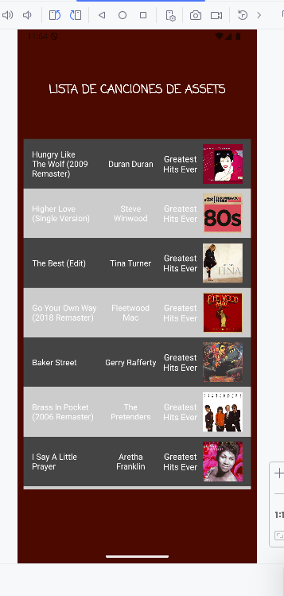
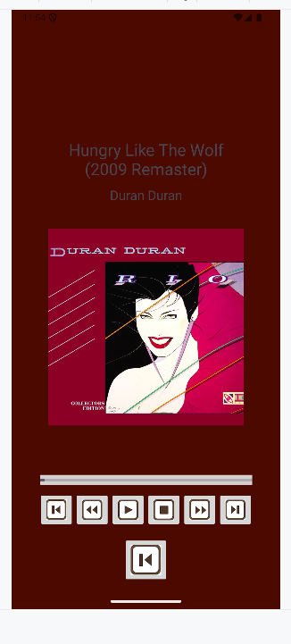

# 🎵 First Android Music Player  

Este proyecto ha sido mi **primera aplicación en Android**, creada con el objetivo de aplicar los conocimientos adquiridos en programación con Java.  

Aplicación Android desarrollada en **Java** con **Android Studio** que permite la reproducción de música desde archivos almacenados en la carpeta **assets/musica**.  

## 📌 Características  

✔️ Exploración automática de archivos **MP3** desde la carpeta **assets/musica**.  

✔️ **RecyclerView** para mostrar la lista de canciones con información:  
   - 🎵 Nombre de la canción  
   - 🎤 Autor  
   - 💿 Álbum  
   - 🖼️ Imagen de la carátula

✔️ **Pantalla de reproducción** con controles interactivos:  
   - ▶️ Play / ⏸️ Pausa  
   - ⏹️ Stop (reinicia la canción)  
   - ⏩ Avanzar 10 segundos  
   - ⏪ Retroceder 10 segundos  
   - ⏭️ Siguiente canción  
   - ⏮️ Canción anterior  
   - 📊 Barra de progreso interactiva

✔️ 📲 Opción para volver a la lista de canciones (al hacerlo, la música se detiene).  

## 🛠 Tecnologías Utilizadas  

- **Android Studio** 
- **Java**
- **XML**
- **RecyclerView** para una navegación eficiente  
- **MediaPlayer** para la reproducción de audio  
- **Carpeta Assets** para almacenar y leer archivos de música  

## 📸 Capturas de Pantalla  

📌 Autor: [edulumulu]

